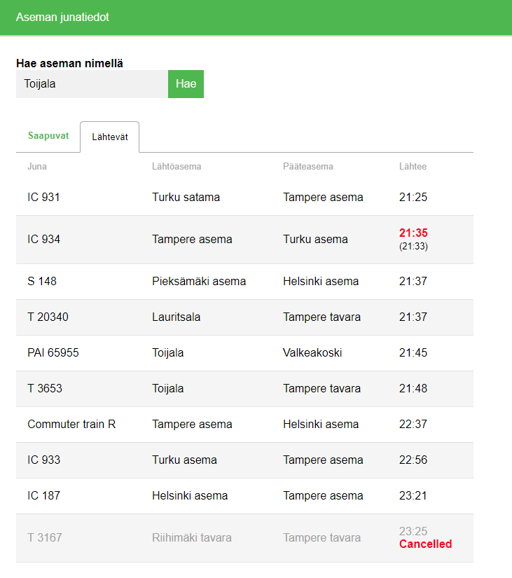

# VR STATION APP #

Small React app for inspecting trains leaving from VR's stations.
[App is hosted with Heroku.](https://vr-asema-app.herokuapp.com/)

Ideas for improvements:
* Improved search field
    * Better suggestion system, maybe on keyup.
    * Bug with station not updating everytime.
        * Issue partly unknown, but re-focusing search field helps.
    * Notification when search fails.
* Improved train sorting. 
    * Trains with stop time past midnight (e.g. 00:12) jump to the start of the list.
    * This is because the clock times are sorted in ascending order.

This project was bootstrapped with [Create React App](https://github.com/facebookincubator/create-react-app).